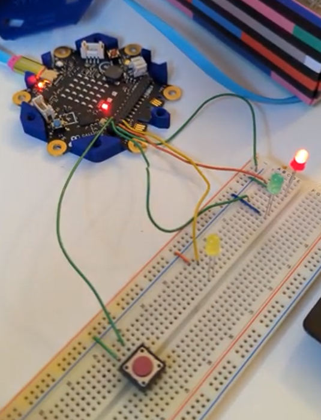

> Diese Seite bei [https://egoexpress.github.io/coderdojo-trafficlights/](https://egoexpress.github.io/coderdojo-trafficlights/) öffnen

## Funktion

Mit diesem Quellcode kann eine Ampelsteuerung mit Hilfe eines Calliope Mini v3 simuliert werden.
Für die Fahrzeugampel kommen die 3 LED des Calliope selbst zum Einsatz, die Fussgängerampel wird durch externe LED simuliert.
Die gelbe LED bei der Fussgängerampel steht für die 'Signal kommt'-Anzeige.

Ein Video zur Funktion der Ampel findet sich unter [hier](https://photos.app.goo.gl/s7xiUNaMm1jNQMFY7).

## Als Erweiterung verwenden

Dieses Repository kann als **Erweiterung** in MakeCode hinzugefügt werden.

* öffne [https://makecode.calliope.cc/](https://makecode.calliope.cc/)
* klicke auf **Neues Projekt**
* klicke auf **Erweiterungen** unter dem Zahnrad-Menü
* nach **https://github.com/egoexpress/coderdojo-trafficlights** suchen und importieren

## Dieses Projekt bearbeiten

Um dieses Repository in MakeCode zu bearbeiten.

* öffne [https://makecode.calliope.cc/](https://makecode.calliope.cc/)
* klicke auf **Importieren** und dann auf **Importiere URL**
* füge **https://github.com/egoexpress/coderdojo-trafficlights** ein und klicke auf Importieren

#### Metadaten (verwendet für Suche, Rendering)

* for PXT/calliopemini

